# WestMarch 项目架构分析报告

## 项目概述

WestMarch 是一个基于 Next.js 16 的 D&amp;D（龙与地下城）跑团门户系统，采用现代化的技术栈构建，包含用户管理、角色管理、世界地图、公告栏、组队系统、文档管理等核心功能。

**技术栈：**
- 框架: Next.js 16.1.6
- 语言: TypeScript 5
- UI: React 19 + Tailwind CSS 3.4.1
- 数据库: SQLite + Prisma 6.5.0
- 状态管理: React Context API
- 地图: ReactFlow (@xyflow/react)
- Markdown: react-markdown + remark-gfm
- 主题: next-themes

---

## 1. 模块列表及职责

### 1.1 核心基础设施模块

| 模块路径 | 主要职责 |
|---------|---------|
| `prisma/schema.prisma` | 数据库数据模型定义 |
| `src/app/layout.tsx` | 根布局，提供主题、认证和应用上下文 |
| `src/app/globals.css` | 全局样式定义 |
| `src/types/global.d.ts` | 全局类型定义 |

### 1.2 上下文模块 (Contexts)

| 模块路径 | 主要职责 |
|---------|---------|
| `src/contexts/AuthContext.tsx` | 用户认证状态管理，提供 login/logout 功能 |
| `src/contexts/AppContext.tsx` | 应用全局状态管理：资源、文档、设置等 |

### 1.3 库模块 (Lib)

| 模块路径 | 主要职责 |
|---------|---------|
| `src/lib/prisma.ts` | Prisma 客户端单例初始化 |
| `src/lib/utils.ts` | 通用工具函数（cn 样式合并） |
| `src/lib/indexedDB.ts` | 浏览器 IndexedDB 本地存储封装 |

### 1.4 UI 组件模块

| 模块路径 | 主要职责 |
|---------|---------|
| `src/components/theme-provider.tsx` | 主题提供者包装器 |
| `src/components/ui/button.tsx` | 可复用按钮组件 |
| `src/components/ui/card.tsx` | 卡片及其子组件（CardHeader/CardTitle等） |

### 1.5 API 路由模块

| 模块路径 | HTTP 方法 | 主要职责 |
|---------|----------|---------|
| `src/app/api/auth/login/route.ts` | POST | 用户登录/注册（自动创建新用户） |
| `src/app/api/characters/route.ts` | GET, POST | 获取/创建角色 |
| `src/app/api/characters/[id]/route.ts` | GET, PUT, DELETE | 角色详情操作 |
| `src/app/api/documents/route.ts` | GET, POST | 获取/创建文档（含默认文档初始化） |
| `src/app/api/documents/[id]/route.ts` | GET, PUT, DELETE | 文档详情操作 |
| `src/app/api/posts/route.ts` | GET, POST | 获取/创建帖子（布告栏） |
| `src/app/api/posts/[id]/route.ts` | GET, PUT, DELETE | 帖子详情操作 |
| `src/app/api/resources/route.ts` | GET, POST | 获取/创建资源图片 |
| `src/app/api/resources/[id]/route.ts` | GET, PUT, DELETE | 资源图片详情操作 |
| `src/app/api/parties/route.ts` | GET, POST | 获取/创建组队信息 |
| `src/app/api/parties/[id]/route.ts` | GET, PUT, DELETE | 组队信息详情操作 |
| `src/app/api/map/route.ts` | GET | 获取完整地图数据（节点+边） |
| `src/app/api/map/nodes/route.ts` | GET, POST | 获取/创建地图节点 |
| `src/app/api/map/nodes/[id]/route.ts` | GET, PUT, DELETE | 地图节点详情操作 |
| `src/app/api/map/edges/route.ts` | GET, POST | 获取/创建地图边 |
| `src/app/api/map/edges/[id]/route.ts` | GET, PUT, DELETE | 地图边详情操作 |
| `src/app/api/settings/[userId]/route.ts` | GET, PUT | 获取/更新用户设置 |

### 1.6 页面模块 (Pages)

| 模块路径 | 主要职责 |
|---------|---------|
| `src/app/page.tsx` | 首页，提供导航入口和登录功能 |
| `src/app/board/page.tsx` | 酒馆布告栏，展示/创建/编辑/删除帖子 |
| `src/app/characters/page.tsx` | 角色管理页面 |
| `src/app/docs/page.tsx` | 文档列表页（占位实现） |
| `src/app/docs/[slug]/page.tsx` | 文档详情页 |
| `src/app/docs/layout.tsx` | 文档页布局 |
| `src/app/map/page.tsx` | 世界地图（ReactFlow 拓扑图） |
| `src/app/party/page.tsx` | 组队界面 |
| `src/app/profile/page.tsx` | 个人中心 |
| `src/app/resources/page.tsx` | 资源管理页面 |

---

## 2. 数据库模型

### 核心实体关系

```
User (用户)
  ├── Character (角色) [1:N]
  ├── Post (帖子) [1:N]
  ├── Party (组队) [1:N]
  ├── ResourceImage (资源) [1:N]
  └── UserSetting (设置) [1:1]

Character (角色)
  ├── Post (帖子) [1:N]
  ├── Party (组队) [1:N]
  └── PartyMember (队员) [1:N]

Post (帖子)
  ├── User (作者) [N:1]
  └── Character (关联角色) [N:1]

MapNode (地图节点)
  ├── MapEdge (作为源) [1:N]
  └── MapEdge (作为目标) [1:N]

Party (组队)
  ├── User (作者) [N:1]
  ├── Character (关联角色) [N:1]
  └── PartyMember (队员) [1:N]

Document (文档) - 独立实体
ResourceImage (资源) - 独立实体
UserSetting (设置) - 独立实体
```

### 枚举类型

- **PostTag**: DM悬赏, 寻找队伍, 跑团战报
- **MapNodeType**: 城镇, 地点, 事件

---

## 3. 模块依赖关系图

### 3.1 Mermaid 依赖图

```mermaid
graph TB
    %% 样式定义
    classDef page fill:#e1f5ff,stroke:#0066cc,stroke-width:2px;
    classDef context fill:#fff4e1,stroke:#cc6600,stroke-width:2px;
    classDef component fill:#e8f5e9,stroke:#2e7d32,stroke-width:2px;
    classDef api fill:#f3e5f5,stroke:#7b1fa2,stroke-width:2px;
    classDef lib fill:#fce4ec,stroke:#c2185b,stroke-width:2px;
    classDef db fill:#fffde7,stroke:#fbc02d,stroke-width:2px;

    %% 数据库层
    PrismaSchema[(prisma/schema.prisma)]:::db
    PrismaClient[lib/prisma.ts]:::lib

    %% 工具层
    Utils[lib/utils.ts]:::lib
    IndexedDB[lib/indexedDB.ts]:::lib

    %% UI 组件层
    ThemeProvider[components/theme-provider.tsx]:::component
    Button[components/ui/button.tsx]:::component
    Card[components/ui/card.tsx]:::component

    %% 上下文层
    AuthContext[contexts/AuthContext.tsx]:::context
    AppContext[contexts/AppContext.tsx]:::context

    %% API 路由层
    subgraph API_Routes
        AuthAPI[api/auth/login]:::api
        CharactersAPI[api/characters]:::api
        DocumentsAPI[api/documents]:::api
        PostsAPI[api/posts]:::api
        ResourcesAPI[api/resources]:::api
        PartiesAPI[api/parties]:::api
        MapAPI[api/map]:::api
        SettingsAPI[api/settings]:::api
    end

    %% 页面层
    subgraph Pages
        HomePage[app/page.tsx]:::page
        BoardPage[app/board/page.tsx]:::page
        MapPage[app/map/page.tsx]:::page
        DocsPage[app/docs/page.tsx]:::page
        PartyPage[app/party/page.tsx]:::page
        ProfilePage[app/profile/page.tsx]:::page
        CharactersPage[app/characters/page.tsx]:::page
        ResourcesPage[app/resources/page.tsx]:::page
    end

    %% 根布局
    RootLayout[app/layout.tsx]:::page

    %% 依赖关系 - 数据库
    PrismaSchema --> PrismaClient
    PrismaClient --> AuthAPI
    PrismaClient --> CharactersAPI
    PrismaClient --> DocumentsAPI
    PrismaClient --> PostsAPI
    PrismaClient --> ResourcesAPI
    PrismaClient --> PartiesAPI
    PrismaClient --> MapAPI
    PrismaClient --> SettingsAPI

    %% 依赖关系 - 工具
    Utils --> Button
    Utils --> Card

    %% 依赖关系 - UI 组件
    ThemeProvider --> RootLayout
    Button --> HomePage
    Button --> BoardPage
    Button --> MapPage
    Card --> HomePage
    Card --> BoardPage
    Card --> MapPage

    %% 依赖关系 - 上下文
    AuthContext --> RootLayout
    AppContext --> RootLayout
    AuthContext --> AppContext
    AuthContext --> HomePage
    AuthContext --> BoardPage
    AppContext --> HomePage
    AppContext --> BoardPage
    AppContext --> MapPage

    %% 依赖关系 - API 调用
    AuthAPI --> AuthContext
    CharactersAPI --> CharactersPage
    DocumentsAPI --> AppContext
    PostsAPI --> BoardPage
    ResourcesAPI --> AppContext
    ResourcesAPI --> ResourcesPage
    PartiesAPI --> PartyPage
    MapAPI --> MapPage
    SettingsAPI --> AppContext
    SettingsAPI --> ProfilePage

    %% 依赖关系 - 页面
    RootLayout --> HomePage
    RootLayout --> BoardPage
    RootLayout --> MapPage
    RootLayout --> DocsPage
    RootLayout --> PartyPage
    RootLayout --> ProfilePage
    RootLayout --> CharactersPage
    RootLayout --> ResourcesPage
```



### 3.2 简化的依赖层次

```
┌─────────────────────────────────────────────────────────┐
│                        Pages (页面层)                    │
│  Home, Board, Map, Docs, Party, Profile, Characters,    │
│  Resources                                                │
└──────────────────────┬──────────────────────────────────┘
                       │
┌──────────────────────▼──────────────────────────────────┐
│                      Contexts (上下文层)                  │
│              AuthContext, AppContext                     │
└──────────────────────┬──────────────────────────────────┘
                       │
        ┌──────────────┼──────────────┐
        │              │              │
┌───────▼──────┐ ┌───▼────┐ ┌──────▼────────┐
│  Components  │ │  API   │ │     Lib       │
│ (UI组件层)   │ │(路由层)│ │  (工具层)     │
└──────────────┘ └────────┘ └──────┬────────┘
                                      │
                              ┌───────▼────────┐
                              │   Database      │
                              │  (数据层)       │
                              └────────────────┘
```

---

## 4. 依赖关系分析

### 4.1 核心依赖流

1. **数据库 → API 层**: 所有 API 路由都依赖 `lib/prisma.ts` 提供的 Prisma 客户端来访问数据库
2. **API → 上下文层**: 上下文模块通过 fetch 调用相应的 API 来获取和更新数据
3. **上下文 → 页面层**: 页面通过 `useAuth()` 和 `useApp()` hooks 访问全局状态
4. **UI 组件 → 工具层**: UI 组件使用 `lib/utils.ts` 中的 `cn()` 函数合并样式类

### 4.2 关键依赖链

#### 认证流程
```
page.tsx → useAuth() → AuthContext → /api/auth/login → prisma → User 表
```

#### 布告栏流程
```
board/page.tsx → useApp() + fetch → /api/posts → prisma → Post 表
```

#### 地图流程
```
map/page.tsx → useApp() + fetch → /api/map → prisma → MapNode + MapEdge 表
```

### 4.3 耦合度分析

| 模块类型 | 耦合度 | 说明 |
|---------|-------|------|
| 页面层 | 中高 | 页面直接依赖 Context 和 UI 组件 |
| 上下文层 | 中 | 依赖 API 路由，但通过 fetch 解耦 |
| API 路由层 | 高 | 直接依赖 Prisma 客户端和数据库模型 |
| UI 组件层 | 低 | 相对独立，仅依赖工具函数 |
| 工具层 | 极低 | 无内部依赖，纯函数 |

---

## 5. 架构特点

### 5.1 优点

1. **清晰的分层架构**: 页面、上下文、API、工具、数据库层次分明
2. **Next.js App Router**: 利用最新的 Next.js 16 特性
3. **类型安全**: 完整的 TypeScript 类型定义
4. **组件复用**: UI 组件设计为可复用
5. **状态集中管理**: 使用 React Context 管理全局状态
6. **ORM 抽象**: Prisma 提供类型安全的数据库访问

### 5.2 架构建议

1. **状态管理**: 随着项目增长，可考虑引入 Zustand 或 Redux 替代 Context
2. **错误处理**: API 层可增加统一的错误处理中间件
3. **数据验证**: 可引入 Zod 进行输入数据验证
4. **API 抽象**: 可创建 API client 层封装 fetch 调用
5. **测试**: 建议增加单元测试和 E2E 测试

---

## 6. 文件结构总览

```
WestMarch/
├── prisma/
│   └── schema.prisma              # 数据库模型定义
├── public/
│   └── images/                    # 静态图片资源
├── src/
│   ├── app/
│   │   ├── api/                   # API 路由
│   │   │   ├── auth/
│   │   │   ├── characters/
│   │   │   ├── documents/
│   │   │   ├── map/
│   │   │   ├── parties/
│   │   │   ├── posts/
│   │   │   ├── resources/
│   │   │   └── settings/
│   │   ├── board/                 # 布告栏页面
│   │   ├── characters/            # 角色页面
│   │   ├── docs/                  # 文档页面
│   │   ├── map/                   # 地图页面
│   │   ├── party/                 # 组队页面
│   │   ├── profile/               # 个人中心
│   │   ├── resources/             # 资源页面
│   │   ├── layout.tsx             # 根布局
│   │   ├── page.tsx               # 首页
│   │   └── globals.css            # 全局样式
│   ├── components/
│   │   ├── ui/                    # UI 基础组件
│   │   │   ├── button.tsx
│   │   │   └── card.tsx
│   │   └── theme-provider.tsx
│   ├── contexts/                  # React Context
│   │   ├── AppContext.tsx
│   │   └── AuthContext.tsx
│   ├── lib/                       # 工具库
│   │   ├── indexedDB.ts
│   │   ├── prisma.ts
│   │   └── utils.ts
│   └── types/                     # 类型定义
│       └── global.d.ts
├── Dockerfile                     # Docker 配置
├── docker-compose.yml
├── package.json
├── tailwind.config.ts
├── tsconfig.json
└── next.config.ts
```

---

## 7. 总结

WestMarch 项目采用了现代化的 Next.js 技术栈，架构清晰，模块化程度良好。项目通过 React Context 管理全局状态，Prisma 提供类型安全的数据库访问，UI 组件复用性强。整体架构适合中小型应用，具有良好的可扩展性和维护性。
