# WestMarch 项目模块化改进报告

**报告日期**: 2026-02-25  
**项目版本**: WestMarch v1.0  
**报告类型**: 完整模块化改进方案

---

## 目录

1. [执行摘要和项目概述](#1-执行摘要和项目概述)
2. [模块架构和依赖关系分析](#2-模块架构和依赖关系分析)
3. [强耦合模块对识别](#3-强耦合模块对识别)
4. [模块独立性评估](#4-模块独立性评估)
5. [问题清单汇总](#5-问题清单汇总)
6. [最小化重构方案](#6-最小化重构方案)
7. [风险评估](#7-风险评估)
8. [重构实施路线图](#8-重构实施路线图)
9. [预期收益分析](#9-预期收益分析)
10. [验证检查清单](#10-验证检查清单)

---

## 1. 执行摘要和项目概述

### 1.1 执行摘要

WestMarch 是一个基于 Next.js 16 的 D&D 跑团门户系统，采用现代化技术栈构建。本报告对项目的模块化架构、耦合度和模块独立性进行了全面分析，并提供了分阶段的重构方案。

**关键发现**:
- 整体架构耦合度：**中高**
- 模块独立性评级：4 个优秀，1 个良好，5 个中等，3 个较差，1 个很差
- 最严重问题：AppContext.tsx 职责过载（12/60 分）
- 最广泛问题：API 路由层缺乏抽象（14 个文件直接依赖 Prisma）

**预期收益**:
- 降低整体耦合度 🔴→ 🟡
- 提高可测试性和可维护性
- 为未来功能扩展奠定良好基础

### 1.2 项目概述

**技术栈**:
- 框架: Next.js 16.1.6
- 语言: TypeScript 5
- UI: React 19 + Tailwind CSS 3.4.1
- 数据库: SQLite + Prisma 6.5.0
- 状态管理: React Context API
- 地图: ReactFlow (@xyflow/react)

**核心功能模块**:
- 用户认证与管理
- 角色管理
- 世界地图
- 公告栏
- 组队系统
- 文档管理
- 资源管理

---

## 2. 模块架构和依赖关系分析

### 2.1 当前架构分层

```
┌─────────────────────────────────────────────────────────┐
│                        Pages (页面层)                    │
│  Home, Board, Map, Docs, Party, Profile, Characters,    │
│  Resources                                                │
└──────────────────────┬──────────────────────────────────┘
                       │
┌──────────────────────▼──────────────────────────────────┐
│                      Contexts (上下文层)                  │
│              AuthContext, AppContext                     │
└──────────────────────┬──────────────────────────────────┘
                       │
        ┌──────────────┼──────────────┐
        │              │              │
┌───────▼──────┐ ┌───▼────┐ ┌──────▼────────┐
│  Components  │ │  API   │ │     Lib       │
│ (UI组件层)   │ │(路由层)│ │  (工具层)     │
└──────────────┘ └────────┘ └──────┬────────┘
                                      │
                              ┌───────▼────────┐
                              │   Database      │
                              │  (数据层)       │
                              └────────────────┘
```

### 2.2 Mermaid 依赖关系图

```mermaid
graph TB
    %% 样式定义
    classDef page fill:#e1f5ff,stroke:#0066cc,stroke-width:2px;
    classDef context fill:#fff4e1,stroke:#cc6600,stroke-width:2px;
    classDef component fill:#e8f5e9,stroke:#2e7d32,stroke-width:2px;
    classDef api fill:#f3e5f5,stroke:#7b1fa2,stroke-width:2px;
    classDef lib fill:#fce4ec,stroke:#c2185b,stroke-width:2px;
    classDef db fill:#fffde7,stroke:#fbc02d,stroke-width:2px;

    %% 数据库层
    PrismaSchema[(prisma/schema.prisma)]:::db
    PrismaClient[lib/prisma.ts]:::lib

    %% 工具层
    Utils[lib/utils.ts]:::lib
    IndexedDB[lib/indexedDB.ts]:::lib

    %% UI 组件层
    ThemeProvider[components/theme-provider.tsx]:::component
    Button[components/ui/button.tsx]:::component
    Card[components/ui/card.tsx]:::component

    %% 上下文层
    AuthContext[contexts/AuthContext.tsx]:::context
    AppContext[contexts/AppContext.tsx]:::context

    %% API 路由层
    subgraph API_Routes
        AuthAPI[api/auth/login]:::api
        CharactersAPI[api/characters]:::api
        DocumentsAPI[api/documents]:::api
        PostsAPI[api/posts]:::api
        ResourcesAPI[api/resources]:::api
        PartiesAPI[api/parties]:::api
        MapAPI[api/map]:::api
        SettingsAPI[api/settings]:::api
    end

    %% 页面层
    subgraph Pages
        HomePage[app/page.tsx]:::page
        BoardPage[app/board/page.tsx]:::page
        MapPage[app/map/page.tsx]:::page
        DocsPage[app/docs/page.tsx]:::page
        PartyPage[app/party/page.tsx]:::page
        ProfilePage[app/profile/page.tsx]:::page
        CharactersPage[app/characters/page.tsx]:::page
        ResourcesPage[app/resources/page.tsx]:::page
    end

    %% 根布局
    RootLayout[app/layout.tsx]:::page

    %% 依赖关系 - 数据库
    PrismaSchema --> PrismaClient
    PrismaClient --> AuthAPI
    PrismaClient --> CharactersAPI
    PrismaClient --> DocumentsAPI
    PrismaClient --> PostsAPI
    PrismaClient --> ResourcesAPI
    PrismaClient --> PartiesAPI
    PrismaClient --> MapAPI
    PrismaClient --> SettingsAPI

    %% 依赖关系 - 工具
    Utils --> Button
    Utils --> Card

    %% 依赖关系 - UI 组件
    ThemeProvider --> RootLayout
    Button --> HomePage
    Button --> BoardPage
    Button --> MapPage
    Card --> HomePage
    Card --> BoardPage
    Card --> MapPage

    %% 依赖关系 - 上下文
    AuthContext --> RootLayout
    AppContext --> RootLayout
    AuthContext --> AppContext
    AuthContext --> HomePage
    AuthContext --> BoardPage
    AppContext --> HomePage
    AppContext --> BoardPage
    AppContext --> MapPage

    %% 依赖关系 - API 调用
    AuthAPI --> AuthContext
    CharactersAPI --> CharactersPage
    DocumentsAPI --> AppContext
    PostsAPI --> BoardPage
    ResourcesAPI --> AppContext
    ResourcesAPI --> ResourcesPage
    PartiesAPI --> PartyPage
    MapAPI --> MapPage
    SettingsAPI --> AppContext
    SettingsAPI --> ProfilePage

    %% 依赖关系 - 页面
    RootLayout --> HomePage
    RootLayout --> BoardPage
    RootLayout --> MapPage
    RootLayout --> DocsPage
    RootLayout --> PartyPage
    RootLayout --> ProfilePage
    RootLayout --> CharactersPage
    RootLayout --> ResourcesPage
```



### 2.3 目标架构（重构后）

```
┌─────────────────────────────────────────────────────────┐
│                        Pages (页面层)                    │
└──────────────────────┬──────────────────────────────────┘
                       │
┌──────────────────────▼──────────────────────────────────┐
│                   Contexts (上下文层)                     │
│  AuthContext  │  ResourcesContext  │  DocumentsContext  │
│  SettingsContext                                           │
└──────────────────────┬──────────────────────────────────┘
                       │
┌──────────────────────▼──────────────────────────────────┐
│                   API Client (服务层)                     │
│              postsApi, charactersApi, ...                 │
└──────────────────────┬──────────────────────────────────┘
                       │
        ┌──────────────┼──────────────┐
        │              │              │
┌───────▼──────┐ ┌───▼────┐ ┌──────▼────────┐
│  Components  │ │  API   │ │     Lib       │
│ (UI组件层)   │ │(路由层)│ │  (工具层)     │
└──────────────┘ └───┬────┘ └───────────────┘
                      │
              ┌───────▼────────┐
              │  Repository    │
              │     层         │
              └───────┬────────┘
                      │
              ┌───────▼────────┐
              │   Prisma       │
              │   (数据层)     │
              └────────────────┘
```

---

## 3. 强耦合模块对识别

### 3.1 耦合度统计

| 耦合类型 | 数量 | 严重程度 |
|---------|------|---------|
| 公共耦合 (Common Coupling) | 8 | 高 |
| 内容耦合 (Content Coupling) | 0 | 无 |
| 控制耦合 (Control Coupling) | 3 | 中 |
| 印记耦合 (Stamp Coupling) | 5 | 中 |
| **总计** | **16** | |

### 3.2 高严重程度耦合（按优先级排序）

#### 耦合对 #1: AppContext 职责过载
| 项目 | 内容 |
|------|------|
| **模块 A** | `src/contexts/AppContext.tsx` |
| **模块 B** | 自身（职责过载） |
| **耦合类型** | 内部耦合 + 印记耦合 |
| **严重程度** | 🔴 高 |
| **问题描述** | AppContext 包含资源、文档、设置、密码验证等多个不相关的功能，形成"上帝对象" |
| **代码位置** | AppContext.tsx:35-50 |
| **影响评分** | 12/60 分（⚫ 很差） |

#### 耦合对 #2: API 路由层直接依赖 Prisma
| 项目 | 内容 |
|------|------|
| **模块 A** | `src/app/api/**/*.ts` (14 个文件) |
| **模块 B** | `src/lib/prisma.ts` |
| **耦合类型** | 公共耦合 |
| **严重程度** | 🔴 高 |
| **问题描述** | 所有 API 路由直接依赖 Prisma 客户端单例，无抽象层，难以测试和替换数据库 |
| **受影响文件** | 所有 API 路由文件 |
| **影响评分** | 24/60 分（🔴 较差） |

#### 耦合对 #3: AppContext 依赖 AuthContext
| 项目 | 内容 |
|------|------|
| **模块 A** | `src/contexts/AppContext.tsx` |
| **模块 B** | `src/contexts/AuthContext.tsx` |
| **耦合类型** | 公共耦合 |
| **严重程度** | 🔴 高 |
| **问题描述** | AppContext 依赖 AuthContext 的 user 状态，两者共享用户身份信息 |
| **代码位置** | AppContext.tsx:63 |

#### 耦合对 #4: AppContext 与所有页面公共耦合
| 项目 | 内容 |
|------|------|
| **模块 A** | `src/contexts/AppContext.tsx` |
| **模块 B** | 所有页面组件 |
| **耦合类型** | 公共耦合 |
| **严重程度** | 🔴 高 |
| **问题描述** | 多个页面组件共享 AppContext 的全局状态 |

#### 耦合对 #5: AppContext 控制耦合 API 端点
| 项目 | 内容 |
|------|------|
| **模块 A** | `src/contexts/AppContext.tsx` |
| **模块 B** | `/api/resources`, `/api/documents`, `/api/settings` |
| **耦合类型** | 控制耦合 |
| **严重程度** | 🔴 高 |
| **问题描述** | AppContext 直接调用多个 API 端点，硬编码 API 路径 |
| **代码位置** | AppContext.tsx:76, 90, 103, 130, 147, 164, 176, 193, 212 |

### 3.3 中严重程度耦合

#### 耦合对 #6: 页面组件印记耦合 AppContext
| 项目 | 内容 |
|------|------|
| **模块 A** | 页面组件 |
| **模块 B** | `src/contexts/AppContext.tsx` |
| **耦合类型** | 印记耦合 |
| **严重程度** | 🟡 中 |
| **问题描述** | 页面组件获取整个 AppContext 对象，即使只需要其中一个属性 |

#### 耦合对 #7: AuthContext 与 localStorage 耦合
| 项目 | 内容 |
|------|------|
| **模块 A** | `src/contexts/AuthContext.tsx` |
| **模块 B** | `localStorage` |
| **耦合类型** | 公共耦合 |
| **严重程度** | 🟡 中 |
| **问题描述** | AuthContext 直接使用 localStorage 持久化用户信息 |
| **代码位置** | AuthContext.tsx:27-33, 55, 65 |

#### 耦合对 #8: BoardPage 直接调用 API
| 项目 | 内容 |
|------|------|
| **模块 A** | `src/app/board/page.tsx` |
| **模块 B** | `/api/posts` |
| **耦合类型** | 控制耦合 |
| **严重程度** | 🟡 中 |
| **问题描述** | BoardPage 直接调用 posts API，自行管理 posts 状态 |

#### 耦合对 #9: 硬编码密码
| 项目 | 内容 |
|------|------|
| **模块 A** | `src/contexts/AppContext.tsx` |
| **模块 B** | 硬编码密码 |
| **耦合类型** | 控制耦合 |
| **严重程度** | 🟡 中 |
| **问题描述** | AppContext 中硬编码密码 `PASSWORD = "WM2006"` |
| **代码位置** | AppContext.tsx:52, 224-226 |

#### 耦合对 #10: 默认文档硬编码
| 项目 | 内容 |
|------|------|
| **模块 A** | `src/app/api/documents/route.ts` |
| **模块 B** | 默认文档数据 |
| **耦合类型** | 控制耦合 |
| **严重程度** | 🟡 中 |
| **问题描述** | API 路由中硬编码默认文档初始化逻辑 |
| **代码位置** | documents/route.ts:4-91 |

### 3.4 低严重程度耦合（可接受）

| 耦合对 | 模块 | 说明 | 状态 |
|-------|------|------|------|
| #11 | UI 组件 ↔ utils.ts | 数据耦合，良好 | ✅ 可接受 |
| #12 | layout.tsx ↔ Context Providers | 数据耦合，良好 | ✅ 可接受 |
| #13 | 页面组件 ↔ UI 组件 | 数据耦合，良好 | ✅ 可接受 |

---

## 4. 模块独立性评估

### 4.1 评分体系

| 维度 | 评分标准 | 满分 |
|------|---------|------|
| 接口清晰度 | 接口是否清晰定义、类型完整、文档充足 | 10 分 |
| 依赖管理 | 是否通过接口依赖，是否存在直接依赖 | 10 分 |
| 单一职责 | 是否只负责一个明确的功能领域 | 10 分 |
| 配置分离 | 配置与业务逻辑是否分离 | 10 分 |
| 可独立修改 | 修改该模块是否不影响其他模块 | 10 分 |
| 可独立删除 | 删除该模块是否不破坏系统其他部分 | 10 分 |
| **总分** | **各项评分之和** | **60 分** |

### 4.2 评级定义

| 总分范围 | 评级 | 说明 |
|---------|------|------|
| 50-60 分 | 🟢 **优秀** | 模块独立性极高 |
| 40-49 分 | 🟡 **良好** | 模块独立性较好 |
| 30-39 分 | 🟠 **中等** | 模块独立性一般 |
| 20-29 分 | 🔴 **较差** | 模块独立性较差 |
| 0-19 分 | ⚫ **很差** | 模块与系统深度耦合 |

### 4.3 模块评分表格

| 模块 | 路径 | 接口清晰度 | 依赖管理 | 单一职责 | 配置分离 | 可独立修改 | 可独立删除 | 总分 | 评级 |
|------|------|-----------|---------|---------|---------|-----------|-----------|------|------|
| utils.ts | src/lib/utils.ts | 10 | 10 | 10 | 10 | 10 | 9 | 59 | 🟢 |
| indexedDB.ts | src/lib/indexedDB.ts | 8 | 9 | 9 | 7 | 9 | 8 | 50 | 🟢 |
| button.tsx | src/components/ui/button.tsx | 9 | 9 | 10 | 9 | 10 | 9 | 56 | 🟢 |
| card.tsx | src/components/ui/card.tsx | 9 | 9 | 10 | 9 | 10 | 9 | 56 | 🟢 |
| theme-provider.tsx | src/components/theme-provider.tsx | 8 | 8 | 9 | 6 | 8 | 7 | 46 | 🟡 |
| schema.prisma | prisma/schema.prisma | 8 | 10 | 9 | 7 | 5 | 0 | 39 | 🟠 |
| layout.tsx | src/app/layout.tsx | 9 | 7 | 8 | 8 | 5 | 0 | 37 | 🟠 |
| prisma.ts | src/lib/prisma.ts | 8 | 6 | 9 | 7 | 4 | 0 | 34 | 🟠 |
| page.tsx | src/app/page.tsx | 8 | 5 | 8 | 7 | 7 | 3 | 38 | 🟠 |
| board/page.tsx | src/app/board/page.tsx | 7 | 4 | 7 | 4 | 5 | 6 | 33 | 🟠 |
| map/page.tsx | src/app/map/page.tsx | 7 | 4 | 7 | 5 | 5 | 7 | 35 | 🟠 |
| characters/page.tsx | src/app/characters/page.tsx | 7 | 4 | 7 | 5 | 5 | 7 | 35 | 🟠 |
| AuthContext.tsx | src/contexts/AuthContext.tsx | 8 | 5 | 7 | 4 | 3 | 0 | 27 | 🔴 |
| API 路由层 | src/app/api/** | 7 | 2 | 6 | 4 | 3 | 2 | 24 | 🔴 |
| AppContext.tsx | src/contexts/AppContext.tsx | 6 | 2 | 1 | 2 | 1 | 0 | 12 | ⚫ |

### 4.4 模块评级分布

| 评级 | 模块数量 | 占比 | 模块列表 |
|------|---------|------|---------|
| 🟢 优秀 | 4 | 23.5% | utils.ts, indexedDB.ts, button.tsx, card.tsx |
| 🟡 良好 | 1 | 5.9% | theme-provider.tsx |
| 🟠 中等 | 5 | 29.4% | schema.prisma, layout.tsx, prisma.ts, page.tsx, board/page.tsx, map/page.tsx, characters/page.tsx |
| 🔴 较差 | 3 | 17.6% | AuthContext.tsx, API 路由层整体 |
| ⚫ 很差 | 1 | 5.9% | AppContext.tsx |

---

## 5. 问题清单汇总

### 5.1 高优先级问题（立即解决）

| ID | 问题描述 | 影响范围 | 严重程度 |
|----|---------|---------|---------|
| P1 | AppContext.tsx 职责过载，承担资源、文档、设置、密码验证等多项职责 | 所有页面 | 🔴 严重 |
| P2 | API 路由层缺乏抽象，所有 14 个 API 路由直接依赖 Prisma Client | API 层 | 🔴 严重 |
| P3 | AppContext 硬编码密码 "WM2006" | 安全性 | 🔴 严重 |
| P4 | AppContext 硬编码 API 路径 | Context 层 | 🔴 严重 |
| P5 | 多个模块共享全局 Context 状态，公共耦合严重 | 页面层 | 🔴 严重 |

### 5.2 中优先级问题（尽快解决）

| ID | 问题描述 | 影响范围 | 严重程度 |
|----|---------|---------|---------|
| P6 | 状态管理不一致：部分页面用 Context，部分自行管理 | 页面层 | 🟡 中等 |
| P7 | AuthContext 直接使用 localStorage，存储逻辑与认证逻辑耦合 | Auth 层 | 🟡 中等 |
| P8 | 默认文档硬编码在 documents/route.ts 中 | API 层 | 🟡 中等 |
| P9 | localStorage keys 硬编码 | 多个模块 | 🟡 中等 |
| P10 | BoardPage 直接使用 localStorage 存储搜索历史 | Board 页面 | 🟡 中等 |

### 5.3 低优先级问题（可选）

| ID | 问题描述 | 影响范围 | 严重程度 |
|----|---------|---------|---------|
| P11 | theme-provider.tsx 默认主题硬编码为 "dark" | 主题 | 🟢 轻微 |
| P12 | indexedDB.ts 数据库名和版本硬编码 | IndexedDB | 🟢 轻微 |

---

## 6. 最小化重构方案

### 6.1 高优先级（立即重构）

#### 重构方案 1: 拆分 AppContext

**问题描述**:
AppContext.tsx 职责过载，承担资源管理、文档管理、设置管理、密码验证等多项职责，形成"上帝对象"。

**重构目标**:
- 将 AppContext 拆分为多个专用 Context
- 提高模块内聚性
- 降低耦合度
- 便于独立测试和维护

**具体实施步骤**:

1. **创建 ResourcesContext**
   ```
   src/contexts/
   ├── ResourcesContext.tsx  (新建)
   ```
   - 管理 resources 状态
   - 提供 addResource, deleteResource, loadResources 方法

2. **创建 DocumentsContext**
   ```
   src/contexts/
   ├── DocumentsContext.tsx  (新建)
   ```
   - 管理 documents 状态
   - 提供 addDocument, updateDocument, deleteDocument, loadDocuments 方法

3. **创建 SettingsContext**
   ```
   src/contexts/
   ├── SettingsContext.tsx  (新建)
   ```
   - 管理 settings 状态
   - 提供 updateSettings, loadSettings 方法

4. **创建 AuthUtils**
   ```
   src/utils/
   ├── auth.ts  (新建)
   ```
   - 提取密码验证逻辑
   - 密码通过环境变量配置

5. **更新 layout.tsx**
   - 替换 AppProvider 为新的 Context Providers
   - 保持 Provider 顺序正确

6. **更新所有使用 AppContext 的页面**
   - 替换 useApp() 为对应的专用 Context hooks
   - 只导入需要的 Context

**前后对比说明**:

| 维度 | 重构前 | 重构后 |
|------|-------|-------|
| AppContext 职责 | 5+ 项功能 | 仅保留 isClient |
| 耦合度 | ⚫ 很差 (12/60) | 🟢 优秀 (每个 Context ~50/60) |
| 可测试性 | 难以独立测试 | 每个 Context 可独立测试 |
| 可维护性 | 修改一处影响所有 | 修改不影响其他 Context |

---

#### 重构方案 2: 引入 Repository 层

**问题描述**:
所有 API 路由直接依赖 Prisma Client，无数据访问抽象层，难以进行单元测试和数据库替换。

**重构目标**:
- 创建 Repository 层抽象数据访问
- 解耦 API 路由与 Prisma
- 便于单元测试
- 支持数据库迁移

**具体实施步骤**:

1. **创建 Repository 目录结构**
   ```
   src/
   ├── repositories/
   │   ├── index.ts
   │   ├── UserRepository.ts
   │   ├── CharacterRepository.ts
   │   ├── PostRepository.ts
   │   ├── DocumentRepository.ts
   │   ├── PartyRepository.ts
   │   ├── MapRepository.ts
   │   ├── ResourceRepository.ts
   │   └── SettingsRepository.ts
   ```

2. **实现基础 Repository 类**
   ```typescript
   // repositories/base.ts
   export abstract class BaseRepository {
     constructor(protected prisma: PrismaClient) {}
   }
   ```

3. **实现各实体 Repository**
   ```typescript
   // repositories/PostRepository.ts
   export class PostRepository extends BaseRepository {
     async findAll() {
       return this.prisma.post.findMany({
         orderBy: { createdAt: 'desc' },
         include: { author: true, character: true }
       });
     }
     
     async create(data: CreatePostInput) {
       return this.prisma.post.create({ data });
     }
     
     async findById(id: string) {
       return this.prisma.post.findUnique({ where: { id } });
     }
     
     async update(id: string, data: UpdatePostInput) {
       return this.prisma.post.update({ where: { id }, data });
     }
     
     async delete(id: string) {
       return this.prisma.post.delete({ where: { id } });
     }
   }
   ```

4. **创建 Repository 工厂**
   ```typescript
   // repositories/index.ts
   import prisma from '@/lib/prisma';
   
   export const repositories = {
     user: new UserRepository(prisma),
     character: new CharacterRepository(prisma),
     post: new PostRepository(prisma),
     document: new DocumentRepository(prisma),
     party: new PartyRepository(prisma),
     map: new MapRepository(prisma),
     resource: new ResourceRepository(prisma),
     settings: new SettingsRepository(prisma),
   };
   ```

5. **更新所有 API 路由**
   - 替换直接的 prisma 调用为 repository 方法
   - 示例:
     ```typescript
     // 重构前
     import prisma from '@/lib/prisma';
     
     export async function GET() {
       const posts = await prisma.post.findMany();
       return NextResponse.json(posts);
     }
     
     // 重构后
     import { repositories } from '@/repositories';
     
     export async function GET() {
       const posts = await repositories.post.findAll();
       return NextResponse.json(posts);
     }
     ```

**前后对比说明**:

| 维度 | 重构前 | 重构后 |
|------|-------|-------|
| API 路由依赖 | 直接依赖 Prisma | 依赖 Repository 接口 |
| 可测试性 | 难以单元测试 | 可 Mock Repository 进行测试 |
| 数据库替换 | 需要修改所有 API 路由 | 只需修改 Repository 实现 |
| 耦合度 | 🔴 较差 (24/60) | 🟡 良好 (~45/60) |

---

#### 重构方案 3: 创建 API Client 层

**问题描述**:
AppContext 和页面组件直接调用 fetch，API 路径硬编码，缺乏统一的错误处理。

**重构目标**:
- 创建 API Client 层封装 API 调用
- 统一错误处理
- 便于添加认证、重试等横切关注点
- 消除硬编码 API 路径

**具体实施步骤**:

1. **创建基础 API Client**
   ```
   src/
   ├── services/
   │   ├── api.ts  (新建)
   │   ├── postsApi.ts  (新建)
   │   ├── charactersApi.ts  (新建)
   │   ├── documentsApi.ts  (新建)
   │   ├── resourcesApi.ts  (新建)
   │   ├── settingsApi.ts  (新建)
   │   ├── mapApi.ts  (新建)
   │   ├── partiesApi.ts  (新建)
   │   ├── authApi.ts  (新建)
   │   └── index.ts
   ```

2. **实现基础 API 客户端**
   ```typescript
   // services/api.ts
   const BASE_URL = '/api';
   
   class ApiClient {
     private async request<T>(
       url: string,
       options: RequestInit = {}
     ): Promise<T> {
       const response = await fetch(`${BASE_URL}${url}`, {
         headers: {
           'Content-Type': 'application/json',
           ...options.headers,
         },
         ...options,
       });
       
       if (!response.ok) {
         throw new Error(`API Error: ${response.status}`);
       }
       
       return response.json();
     }
     
     async get<T>(url: string): Promise<T> {
       return this.request<T>(url, { method: 'GET' });
     }
     
     async post<T>(url: string, data?: any): Promise<T> {
       return this.request<T>(url, {
         method: 'POST',
         body: data ? JSON.stringify(data) : undefined,
       });
     }
     
     async put<T>(url: string, data?: any): Promise<T> {
       return this.request<T>(url, {
         method: 'PUT',
         body: data ? JSON.stringify(data) : undefined,
       });
     }
     
     async delete<T>(url: string): Promise<T> {
       return this.request<T>(url, { method: 'DELETE' });
     }
   }
   
   export const apiClient = new ApiClient();
   ```

3. **实现各模块 API**
   ```typescript
   // services/postsApi.ts
   import { apiClient } from './api';
   
   export const postsApi = {
     getAll: () => apiClient.get<Post[]>('/posts'),
     getById: (id: string) => apiClient.get<Post>(`/posts/${id}`),
     create: (data: CreatePostInput) => apiClient.post<Post>('/posts', data),
     update: (id: string, data: UpdatePostInput) => apiClient.put<Post>(`/posts/${id}`, data),
     delete: (id: string) => apiClient.delete(`/posts/${id}`),
   };
   ```

4. **更新所有使用 fetch 的代码**
   - AppContext.tsx: 替换 fetch 调用为 API Client
   - BoardPage: 替换 fetch 调用为 postsApi
   - MapPage: 替换 fetch 调用为 mapApi
   - CharactersPage: 替换 fetch 调用为 charactersApi

**前后对比说明**:

| 维度 | 重构前 | 重构后 |
|------|-------|-------|
| API 调用方式 | 分散的 fetch 调用 | 统一的 API Client |
| 错误处理 | 无统一处理 | 统一错误处理 |
| 硬编码路径 | 多处硬编码 | 集中定义 |
| 可维护性 | 修改 API 路径需多处修改 | 只需修改一处 |

---

### 6.2 中优先级（尽快重构）

#### 重构方案 4: 创建存储服务层

**问题描述**:
localStorage 使用分散在 AuthContext、BoardPage 等多个模块，storage keys 硬编码。

**重构目标**:
- 统一管理 localStorage 访问
- 集中定义 storage keys
- 便于迁移到其他存储方案

**具体实施步骤**:

1. **创建存储服务**
   ```
   src/
   ├── services/
   │   └── storage.ts  (新建)
   ```

2. **实现存储服务**
   ```typescript
   // services/storage.ts
   const STORAGE_KEYS = {
     USER: 'westmarch_user',
     SEARCH_HISTORY: 'wm-search-history',
   } as const;
   
   type StorageKey = typeof STORAGE_KEYS[keyof typeof STORAGE_KEYS];
   
   export const storage = {
     get: <T>(key: StorageKey): T | null => {
       try {
         const data = localStorage.getItem(key);
         return data ? JSON.parse(data) : null;
       } catch {
         return null;
       }
     },
     
     set: (key: StorageKey, value: any): void => {
       localStorage.setItem(key, JSON.stringify(value));
     },
     
     remove: (key: StorageKey): void => {
       localStorage.removeItem(key);
     },
     
     getUser: () => storage.get<User>(STORAGE_KEYS.USER),
     setUser: (user: User) => storage.set(STORAGE_KEYS.USER, user),
     removeUser: () => storage.remove(STORAGE_KEYS.USER),
     
     getSearchHistory: () => storage.get<string[]>(STORAGE_KEYS.SEARCH_HISTORY),
     setSearchHistory: (history: string[]) => storage.set(STORAGE_KEYS.SEARCH_HISTORY, history),
   };
   ```

3. **更新 AuthContext.tsx**
   - 替换 localStorage 调用为 storage 服务

4. **更新 BoardPage.tsx**
   - 替换 localStorage 调用为 storage 服务

**前后对比说明**:

| 维度 | 重构前 | 重构后 |
|------|-------|-------|
| localStorage 使用 | 分散在多个模块 | 集中在 storage 服务 |
| Storage Keys | 硬编码多处 | 集中定义 |
| 类型安全 | 无类型 | 类型安全 |
| 可迁移性 | 难以迁移 | 易于迁移到其他存储方案 |

---

#### 重构方案 5: 提取配置

**问题描述**:
密码、默认文档等硬编码在代码中，不利于不同环境配置。

**重构目标**:
- 将硬编码配置移至配置文件
- 使用环境变量管理敏感配置
- 便于不同环境部署

**具体实施步骤**:

1. **创建配置目录**
   ```
   src/
   ├── config/
   │   ├── index.ts
   │   ├── defaultDocuments.ts  (新建)
   │   └── auth.ts  (新建)
   ```

2. **提取默认文档**
   ```typescript
   // config/defaultDocuments.ts
   export const defaultDocuments = [
     {
       title: "玩家手册",
       slug: "player-handbook",
       content: "# 玩家手册\n\n欢迎来到 WestMarch...",
     },
     // ... 更多默认文档
   ];
   ```

3. **配置密码**
   ```typescript
   // config/auth.ts
   export const authConfig = {
     adminPassword: process.env.NEXT_PUBLIC_ADMIN_PASSWORD || "WM2006",
   };
   ```

4. **更新 .env.example**
   ```
   NEXT_PUBLIC_ADMIN_PASSWORD=WM2006
   ```

5. **更新使用硬编码的代码**
   - AppContext.tsx: 使用 authConfig.adminPassword
   - documents/route.ts: 使用 defaultDocuments

**前后对比说明**:

| 维度 | 重构前 | 重构后 |
|------|-------|-------|
| 密码存储 | 硬编码在代码中 | 环境变量 |
| 默认文档 | 硬编码在 API 路由中 | 配置文件 |
| 环境配置 | 难以配置 | 易于配置 |
| 安全性 | 密码在代码库中 | 密码不在代码库中 |

---

#### 重构方案 6: 统一状态管理策略

**问题描述**:
状态管理不一致：部分页面使用 AppContext，部分页面自行管理状态（board, map, characters）。

**重构目标**:
- 明确状态管理策略
- 保持代码一致性
- 减少混淆

**具体实施步骤**:

1. **制定状态管理策略**
   | 状态类型 | 推荐方案 |
   |---------|---------|
   | 全局用户状态 | AuthContext |
   | 全局应用设置 | SettingsContext |
   | 全局资源状态 | ResourcesContext |
   | 全局文档状态 | DocumentsContext |
   | 页面级状态 | 页面自行管理 (useState) |
   | 表单临时状态 | 页面自行管理 (useState) |

2. **更新文档**
   - 在代码中添加注释说明状态管理策略

3. **逐步统一**
   - 对于 board, map, characters 页面，评估是否需要将状态移至 Context
   - 保持当前状态，但统一未来开发的状态管理方式

**前后对比说明**:

| 维度 | 重构前 | 重构后 |
|------|-------|-------|
| 状态管理 | 不一致 | 有明确策略 |
| 可维护性 | 容易混淆 | 清晰明确 |
| 新功能开发 | 无指导 | 有明确指导 |

---

### 6.3 低优先级（可选重构）

#### 重构方案 7: 优化 theme-provider

**问题描述**:
theme-provider.tsx 默认主题硬编码为 "dark"。

**重构目标**:
- 将默认主题配置化
- 提高灵活性

**具体实施步骤**:
1. 在 config 中添加主题配置
2. 更新 theme-provider.tsx 使用配置

---

#### 重构方案 8: 优化 indexedDB 配置

**问题描述**:
indexedDB.ts 数据库名和版本硬编码。

**重构目标**:
- 将数据库配置化
- 提高灵活性

**具体实施步骤**:
1. 在 config 中添加 indexedDB 配置
2. 更新 indexedDB.ts 使用配置

---

## 7. 风险评估

### 7.1 风险矩阵

| 风险点 | 可能性 | 影响程度 | 风险等级 | 应对措施 | 回滚方案 |
|-------|-------|---------|---------|---------|---------|
| **高优先级重构风险** | | | | | |
| 拆分 AppContext 时引入 bug | 中 | 高 | 🔴 高 | 1. 逐步迁移，每次只拆一个 Context<br>2. 充分测试每个步骤<br>3. 代码审查 | 使用 Git 回滚到重构前的 commit |
| Repository 层实现不完整 | 中 | 高 | 🔴 高 | 1. 先实现一个 Repository 作为试点<br>2. 完善测试覆盖<br>3. 逐个迁移 API 路由 | 回滚 API 路由到直接使用 Prisma |
| API Client 层错误处理不完善 | 低 | 中 | 🟡 中 | 1. 充分测试各种错误场景<br>2. 保持原有的 fetch 调用作为后备 | 回滚到直接使用 fetch |
| **中优先级重构风险** | | | | | |
| 存储服务引入兼容性问题 | 低 | 中 | 🟡 中 | 1. 保持旧的 localStorage key 兼容<br>2. 添加迁移逻辑 | 回滚到直接使用 localStorage |
| 配置提取导致环境变量缺失 | 低 | 中 | 🟡 中 | 1. 提供合理的默认值<br>2. 更新 .env.example<br>3. 添加启动检查 | 回滚到硬编码配置 |
| **低优先级重构风险** | | | | | |
| 主题配置变化影响用户体验 | 低 | 低 | 🟢 低 | 1. 保持默认值不变<br>2. 渐进式调整 | 回滚到硬编码主题 |

### 7.2 风险缓解策略

#### 策略 1: 分阶段重构
- 不要一次性完成所有重构
- 每个重构阶段独立可交付
- 每个阶段完成后进行充分测试

#### 策略 2: 充分测试
- 单元测试：Repository 层、API Client 层
- 集成测试：API 路由、Context
- E2E 测试：关键用户流程
- 手动测试：UI 交互

#### 策略 3: 代码审查
- 每个重构阶段都进行代码审查
- 至少一人审查
- 使用 Pull Request 流程

#### 策略 4: 回滚计划
- 每个重构阶段都有明确的回滚方案
- 使用 Git 分支管理
- 保留重构前的 commit

---

## 8. 重构实施路线图

### 8.1 时间线（建议 4 周）

#### 第 1 周：准备和高优先级重构（第一部分）

**目标**: 完成 Repository 层和 API Client 层

| 日期 | 任务 | 负责人 | 交付物 |
|------|------|-------|-------|
| 第 1 天 | 项目规划和环境准备 | 团队 | 重构计划确认 |
| 第 2-3 天 | 实现 Repository 层 | 后端开发 | Repository 代码 + 单元测试 |
| 第 4-5 天 | 迁移 API 路由到 Repository | 后端开发 | 更新后的 API 路由 |

#### 第 2 周：高优先级重构（第二部分）

**目标**: 完成 API Client 层和开始拆分 AppContext

| 日期 | 任务 | 负责人 | 交付物 |
|------|------|-------|-------|
| 第 1-2 天 | 实现 API Client 层 | 前端开发 | API Client 代码 |
| 第 3-5 天 | 迁移 fetch 调用到 API Client | 前端开发 | 更新后的 Context 和页面 |

#### 第 3 周：高优先级重构（第三部分）+ 中优先级重构

**目标**: 完成 AppContext 拆分和存储服务

| 日期 | 任务 | 负责人 | 交付物 |
|------|------|-------|-------|
| 第 1-3 天 | 拆分 AppContext 为专用 Context | 前端开发 | ResourcesContext, DocumentsContext, SettingsContext |
| 第 4-5 天 | 实现存储服务层 | 前端开发 | storage.ts + 更新后的代码 |

#### 第 4 周：中优先级重构 + 测试 + 验证

**目标**: 完成配置提取、测试和验证

| 日期 | 任务 | 负责人 | 交付物 |
|------|------|-------|-------|
| 第 1-2 天 | 提取配置到配置文件 | 全栈 | config 目录 + 更新后的代码 |
| 第 3 天 | 完善测试覆盖 | 全栈 | 测试用例 |
| 第 4 天 | 集成测试和 E2E 测试 | 全栈 | 测试报告 |
| 第 5 天 | 验证检查清单 + 部署准备 | 全栈 | 验证报告 |

### 8.2 里程碑

| 里程碑 | 时间点 | 验收标准 |
|-------|-------|---------|
| M1: Repository 层完成 | 第 1 周结束 | 所有 API 路由通过 Repository 访问数据 |
| M2: API Client 层完成 | 第 2 周结束 | 所有 fetch 调用通过 API Client |
| M3: AppContext 拆分完成 | 第 3 周结束 | AppContext 拆分为 3 个专用 Context |
| M4: 所有重构完成 | 第 4 周结束 | 所有重构方案实施完成 |
| M5: 验证通过 | 第 4 周结束 | 验证检查清单全部通过 |

---

## 9. 预期收益分析

### 9.1 技术收益

| 收益项 | 量化指标 | 预期改进 |
|-------|---------|---------|
| 模块独立性 | 平均评分 | 35/60 → 48/60 (+37%) |
| 耦合度 | 整体评级 | 🔴 中高 → 🟡 中等 |
| 可测试性 | 单元测试覆盖率 | ~0% → ~60% |
| 代码复用 | Repository/API Client | 减少重复代码 ~30% |
| 构建时间 | 增量构建 | 无显著变化 |

### 9.2 开发效率收益

| 收益项 | 预期改进 |
|-------|---------|
| 新功能开发时间 | 减少 20-30%（由于更好的抽象） |
| Bug 修复时间 | 减少 30-40%（由于更好的模块隔离） |
| 代码审查时间 | 减少 15-20%（由于更清晰的职责） |
| 新人上手时间 | 减少 40-50%（由于更好的文档和架构） |

### 9.3 维护性收益

| 收益项 | 说明 |
|-------|------|
| 可扩展性 | 新增功能只需添加对应的 Repository 和 API Client |
| 可替换性 | 可以轻松替换数据库或 API 实现 |
| 可测试性 | 可以独立测试每个模块 |
| 可理解性 | 代码结构更清晰，职责更明确 |

### 9.4 风险降低

| 风险项 | 重构前 | 重构后 |
|-------|-------|-------|
| 单一模块故障影响全局 | 高（AppContext） | 低（专用 Context） |
| 数据库迁移难度 | 高 | 低 |
| 技术债务积累 | 快 | 慢 |
| 重构难度 | 高 | 中 |

---

## 10. 验证检查清单

### 10.1 功能验证

- [ ] 所有页面正常加载
- [ ] 用户登录/退出功能正常
- [ ] 角色管理功能正常（创建、编辑、删除）
- [ ] 布告栏功能正常（发布、编辑、删除帖子）
- [ ] 地图功能正常（查看、编辑节点和边）
- [ ] 文档管理功能正常
- [ ] 资源管理功能正常
- [ ] 组队功能正常
- [ ] 个人中心功能正常
- [ ] 主题切换功能正常
- [ ] 数据持久化正常（刷新页面后数据不丢失）

### 10.2 代码质量验证

- [ ] Repository 层已实现并覆盖所有数据访问
- [ ] 所有 API 路由使用 Repository 而非直接使用 Prisma
- [ ] API Client 层已实现
- [ ] 所有 fetch 调用使用 API Client
- [ ] AppContext 已拆分为 ResourcesContext、DocumentsContext、SettingsContext
- [ ] 密码验证已移至独立模块
- [ ] 存储服务层已实现
- [ ] 所有 localStorage 调用使用存储服务
- [ ] 硬编码配置已移至配置文件
- [ ] 环境变量已配置
- [ ] TypeScript 类型完整
- [ ] 无 ESLint 错误
- [ ] 无 TypeScript 编译错误

### 10.3 测试验证

- [ ] Repository 层单元测试覆盖率 ≥ 70%
- [ ] API Client 层单元测试覆盖率 ≥ 70%
- [ ] Context 层单元测试覆盖率 ≥ 60%
- [ ] 集成测试通过
- [ ] E2E 测试通过关键流程
- [ ] 手动测试通过所有功能

### 10.4 性能验证

- [ ] 首屏加载时间无显著增加
- [ ] API 响应时间无显著增加
- [ ] 内存使用无显著增加
- [ ] 无内存泄漏

### 10.5 兼容性验证

- [ ] Chrome 浏览器兼容
- [ ] Firefox 浏览器兼容
- [ ] Safari 浏览器兼容
- [ ] Edge 浏览器兼容
- [ ] 移动端响应式正常

### 10.6 文档验证

- [ ] 代码注释完整
- [ ] README 更新
- [ ] 架构文档更新
- [ ] API 文档更新（如需要）

---

## 附录

### A. 参考文件清单

| 文件路径 | 说明 |
|---------|------|
| `src/contexts/AppContext.tsx` | 应用全局状态管理（待重构） |
| `src/contexts/AuthContext.tsx` | 认证状态管理 |
| `src/lib/prisma.ts` | Prisma 客户端 |
| `src/app/api/**/*.ts` | API 路由层（待重构） |
| `src/app/page.tsx` | 首页 |
| `src/app/board/page.tsx` | 布告栏页面 |
| `src/app/map/page.tsx` | 地图页面 |
| `src/app/characters/page.tsx` | 角色页面 |

### B. 术语表

| 术语 | 说明 |
|------|------|
| 耦合度 (Coupling) | 模块之间相互依赖的程度 |
| 内聚性 (Cohesion) | 模块内部功能的相关性程度 |
| 公共耦合 (Common Coupling) | 多个模块共享同一个全局数据 |
| 控制耦合 (Control Coupling) | 一个模块通过传递控制信息来控制另一个模块 |
| 印记耦合 (Stamp Coupling) | 模块间传递完整的数据结构，但只使用其中一部分 |
| 数据耦合 (Data Coupling) | 模块间仅通过参数传递基本数据类型 |
| Repository 模式 | 一种数据访问抽象模式，封装数据访问逻辑 |
| 上帝对象 (God Object) | 承担过多职责的对象，违反单一职责原则 |

### C. 参考资料

- [Clean Code](https://www.oreilly.com/library/view/clean-code/9780136083238/) - Robert C. Martin
- [Design Patterns](https://www.oreilly.com/library/view/design-patterns-elements/0201633612/) - Gang of Four
- [Domain-Driven Design](https://www.oreilly.com/library/view/domain-driven-design-tackling/0321125215/) - Eric Evans
- [Next.js Documentation](https://nextjs.org/docs)
- [Prisma Documentation](https://www.prisma.io/docs)

---

**报告生成完成**  
**报告版本**: v1.0  
**下次审查建议**: 重构完成后或 3 个月后
